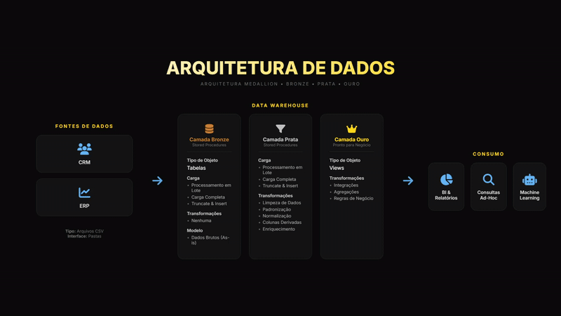
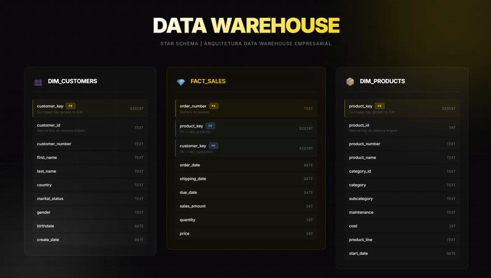

# Data Warehouse

Este projeto demonstra a implementação de uma arquitetura completa de Data Warehouse, abordando desde a ingestão e processamento dos dados até a modelagem e organização das camadas. A solução foi estruturada seguindo boas práticas de engenharia de dados, com foco em performance, escalabilidade e qualidade das informações.

# Arquitetura de dados

Bronze Layer: armazena dados brutos, sem transformações, replica exatamente o formato da origem, carga via Stored Procedure. Estratégia: TRUNCATE + INSERT

Silver Layer: dados tratados e padronizados, aplicação de regras de negócio, enriquecimento de dados, normalização de domínios, carga via Stored Procedure.

Gold Layer: Dados prontos para consumo, views analíticas, modelo dimensional (Star Schema), utilizado por BI, SQL e ML.

# Modelo de dados

